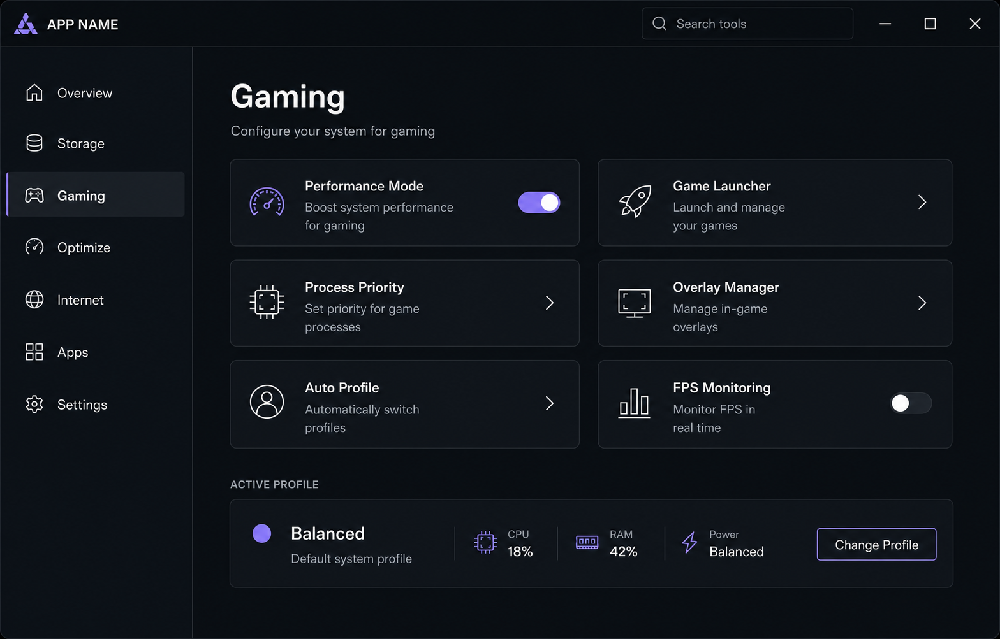

# kernctl

**Your PC, under control.**

kernctl is an early-stage Windows control centre for storage, gaming, performance,
network, application, and safe system-management workflows. This milestone provides
the repository architecture, a polished non-destructive Avalonia UI, a complete
runtime theme customizer under **Settings → Appearance**, the transactional safety
engine, a restricted short-lived Windows elevation broker, and a safe transactional
system-profile builder.

> [!IMPORTANT]
> kernctl is not production-ready. A manually confirmed profile may select one of
> three existing Windows power schemes through the supported Windows API. No scheme
> values, registry settings, services, security controls, or arbitrary processes are
> modified.

## Design reference

The current shell follows the supplied concept while establishing a kernctl-specific
design system.



## Technology

- C# 14 and .NET 10
- Avalonia UI 12.1 with Avalonia XAML
- CommunityToolkit.Mvvm
- Microsoft.Extensions.DependencyInjection
- xUnit v3
- Avalonia ColorPicker

## Prerequisites

- Windows 10 or later
- [.NET 10 SDK](https://dotnet.microsoft.com/download/dotnet/10.0)

## Build and run

```powershell
dotnet restore Kernctl.sln
dotnet build Kernctl.sln --configuration Release --no-restore
dotnet test Kernctl.sln --configuration Release --no-build
dotnet run --project src/Kernctl.App/Kernctl.App.csproj
```

## Solution structure

- `src/Kernctl.App` — Avalonia presentation, controls, views, and view models.
- `src/Kernctl.Broker.Protocol` — strict versioned broker DTOs and framing limits.
- `src/Kernctl.Broker.Client` — broker discovery, UAC launch, and typed diagnostics.
- `src/Kernctl.Broker` — separately elevated one-session diagnostic allowlist.
- `src/Kernctl.Core` — platform-independent contracts, models, and state logic.
- `src/Kernctl.Platform.Windows` — harmless Windows-specific service implementations.
- `tests/Kernctl.Core.Tests` — unit tests for core and view-model behaviour.
- `tests/Kernctl.Broker.Tests` — protocol, allowlist, and Windows IPC security tests.
- `docs` — architecture, safety, and design-system documentation.
- `svgs` — supplied Font Awesome SVG source library, kept in its original categories.

## Design principles

- A restrained, high-contrast dark interface with token-driven styling.
- Reusable controls, local vector assets, and clear keyboard focus.
- MVVM separation with cached page state and dependency injection.
- Honest UI: sample values and unavailable modules are identified explicitly.
- Runtime themes update shared Avalonia resources without recreating pages or restarting.
- Future changes run through versioned plans, durable rollback snapshots, verification,
  reverse-order recovery, and structured history.

## Transactional action safety

kernctl now has a platform-independent transaction engine for future optimizations.
It supports ordered action groups, dry runs, cooperative cancellation, one mutating
transaction at a time, persistent journals, reverse rollback, crash discovery, and
read-only history. Action review, progress, and startup recovery UI foundations are
present; the only production system action selects a known existing Windows power
scheme for the current user.

Journals are stored without elevation under:

```text
%LocalAppData%/kernctl/transactions/
├── active/
│   └── <transaction-id>.json
└── archive/
    └── <transaction-id>.json
```

See [Action engine and rollback safety](docs/action-engine.md) for the lifecycle,
state machines, journal format, and future action requirements.

## System profiles

`Change Profile` now opens the profile browser, details, builder, application-plan,
result, rollback, and history workflow. Battery Saver, Balanced, Gaming, and
Competitive are immutable built-ins; custom profiles use validated typed actions and
atomic versioned JSON. A profile becomes active only after every required action
commits.

The first reversible Windows operation selects an existing known power scheme using
`PowerGetActiveScheme`/`PowerSetActiveScheme`; the exact previous GUID is snapshotted
and restored on rollback. kernctl-only monitoring and preference actions are also
transactional. See [System profiles](docs/system-profiles.md) for the model, UI,
trigger decisions, persistence, and intentional limitations.

## Restricted elevation broker

The UI remains unelevated. A confirmed administrator-required transaction uses
Windows UAC to start a separate broker for one bounded session. The broker accepts
one locally verified client and exposes only information, capabilities, ping, and
shutdown diagnostics in this milestone. It contains no real privileged system
operation.

Release sessions require trusted matching Authenticode signatures. Unsigned Debug
builds use a documented same-directory development exception and must not be
distributed. See [Restricted elevated Windows broker](docs/elevated-broker.md) for
the protocol, identity checks, threat model, packaging, and limitations.

## Theme customization

Appearance settings provide four immutable built-in themes—kernctl Dark, OLED,
Graphite, and Ember—plus named custom themes. Users can edit validated colour tokens,
density, corner style, font scale, and motion, with immediate application-wide preview.
Changes are committed explicitly; cancelling or closing with a preview restores the
last saved theme.

Custom themes can be imported and exported as safe, versioned JSON data. Preferences
are stored without elevation under:

```text
%LocalAppData%/kernctl/
├── settings.json
└── themes/
    └── <sanitized-theme-id>.json
```

Theme files contain only appearance data—never paths, system settings, credentials,
or personal information.

## Safety principles

- The UI process does not run permanently elevated.
- No registry, service, power-plan editing, driver, network, arbitrary-process, or
  unrelated user-file changes are implemented. Profile application may select an
  existing known Windows power scheme after explicit review.
- Future actions must detect, plan, validate, snapshot, apply, verify, and report an
  honest committed or rollback state.
- Sensitive credentials, cookies, and tokens are never collected or logged.

## Roadmap

1. Add automated visual regression coverage for the shell and profile/theme editors.
2. Add unelevated typed Windows event sources for approved automatic profile triggers.
3. Add read-only Windows hardware and storage inventory.
4. Add any future privileged action to the broker allowlist only after isolated
   platform implementation, verification, and rollback tests exist.

## Assets and attribution

The repository's `svgs/brands`, `svgs/regular`, and `svgs/solid` directories were
supplied by the project owner and contain Font Awesome artwork. Font Awesome Free
SVG icons are licensed under CC BY 4.0; see
[Font Awesome Free License](https://fontawesome.com/license/free). Only selected
icons are linked into the application resources. No font file was present in the
initial repository, so this milestone uses the system `Segoe UI Variable`/`Segoe UI`
fallback until the promised local font is added.

No software licence has been added to kernctl; the project owner must choose one.

## Contributing

Read [CONTRIBUTING.md](CONTRIBUTING.md), [SECURITY.md](SECURITY.md), and
[AGENTS.md](AGENTS.md) before making changes. Keep changes focused, run formatting,
build, and tests, and update documentation when behaviour or architecture changes.
